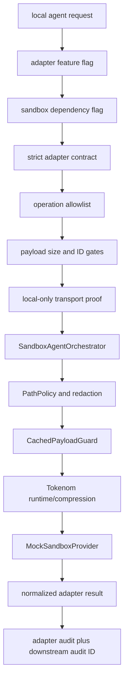

# Controlled Local Agent Adapter Architecture

Task: `TOKENOM-CONTROLLED-LOCAL-AGENT-ADAPTER-006`

This layer adds a local-only adapter boundary between a structured local agent request and the accepted `tokenom.sandbox_agent` integration. It does not create a public API, remote transport, production workflow, private-project path, or real-provider route.

## Discovery Summary

Existing components reused:

- Sandbox orchestration: `tokenom.sandbox_agent.orchestrator.SandboxAgentOrchestrator`.
- Sandbox contracts: `SandboxAgentRequest` and `SandboxAgentResult`.
- Sandbox feature flag: `TOKENOM_SANDBOX_AGENT_INTEGRATION_ENABLED`, default disabled.
- CLI wiring: the existing Click group in `headroom.cli.main`.
- Payload/cache boundary: `CachedPayloadGuard`, used inside the sandbox orchestrator before runtime compression.
- Runtime/compression boundary: the sandbox orchestrator is the only path to `headroom.compress()` for adapter runtime operations.
- Safe audit: `AuditLogger` JSONL records plus sandbox audit helpers.
- Redaction/scanning: `tokenom.security.redactor` and `tokenom.security.scanner`.
- Path policy: `PathPolicy`, delegated through the sandbox orchestrator with the local adapter fixture root as the allowed root.
- Timeout/error contracts: mock provider timeout and error categories are normalized without retry.
- Package API convention: package-level `__init__.py` exports the public adapter objects.

## Flow



`sandbox_health` is the only read-only health operation. It does not process payload content and does not invoke the runtime/provider boundary.

## Trust Boundaries

- Adapter request boundary: accepts only the local adapter contract.
- Transport boundary: in-process Python API and fixture CLI only; no server, listener, socket, WebSocket, background daemon, or remote transport.
- Operation boundary: only `compress_context`, `inspect_payload_safely`, and `sandbox_health` are allowed.
- Filesystem boundary: the workspace root is passed to the sandbox `PathPolicy`; default fixtures are under `tests/fixtures/local_agent_adapter/workspace`.
- Runtime boundary: runtime operations delegate to `SandboxAgentOrchestrator`; the adapter does not call `headroom.compress()` directly.
- Audit boundary: adapter audit stores IDs, operation, payload size/hash, gate decisions, status, attempts, timeout/cancel category, and downstream audit ID only.

## Request Contract

```json
{
  "adapter_request_id": "adapter-001",
  "correlation_id": "corr-001",
  "mode": "sandbox",
  "operation": "compress_context",
  "payload": {
    "content": "dummy fixture content",
    "metadata": {}
  },
  "workspace": {
    "root": "<repo>/tests/fixtures/local_agent_adapter/workspace"
  },
  "execution": {
    "timeout_ms": 5000,
    "allow_retry": false
  }
}
```

Unknown top-level, payload, workspace, and execution fields are rejected. Production/private/provider/dynamic execution keys are rejected. IDs are bounded and must not contain secret-like markers.

## Result Contract

```json
{
  "adapter_request_id": "adapter-001",
  "correlation_id": "corr-001",
  "status": "completed",
  "operation": "compress_context",
  "result": {
    "content": "Mocked sandbox result"
  },
  "security": {
    "sandbox_enforced": true,
    "redaction_applied": false,
    "path_policy_passed": true,
    "external_network_used": false,
    "real_provider_used": false
  },
  "execution": {
    "attempts": 1,
    "retry_executed": false,
    "timed_out": false
  },
  "audit_id": "..."
}
```

Blocked, timeout, cancelled, and failed results are structured and contain no raw payload.

## Operation Allowlist

- `compress_context`: runtime operation, delegated to sandbox.
- `inspect_payload_safely`: runtime operation, delegated to sandbox with the same security gates.
- `sandbox_health`: read-only local health operation, no payload content and no runtime/provider call.

Requests cannot specify modules, functions, shell commands, dynamic imports, provider names, or arbitrary handlers.

## Known Limitations

- The adapter is dummy-only and local-only.
- The feature flag is disabled by default.
- No real provider, private project, production data, remote execution, public endpoint, or production readiness is introduced.
- Timeout simulation is deterministic through the accepted mock provider behavior and performs no sleeping or retry.
