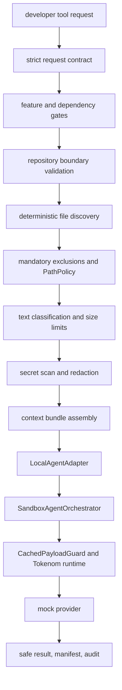

# Local Developer Tool Architecture

Task: `TOKENOM-LOCAL-DEVELOPER-TOOL-INTEGRATION-007`

This integration adds a closed, sandbox-only boundary in front of the accepted
`LocalAgentAdapter` and `SandboxAgentOrchestrator` layers. It prepares a safe
context package from an approved dummy Git repository, delegates execution to
the existing adapter, and writes only safe manifest/audit metadata.

## Discovery

Reused Tokenom components:

- `tokenom.local_agent_adapter.LocalAgentAdapter` for downstream execution.
- `tokenom.sandbox_agent.SandboxAgentOrchestrator` through the adapter.
- `tokenom.security.PathPolicy` for path deny decisions.
- `tokenom.security.scanner.scan_text` and `tokenom.security.redactor.redact_text`.
- `tokenom.security.CachedPayloadGuard` through the sandbox orchestrator.
- `tokenom.security.AuditLogger` for JSONL audit records.
- `headroom.compress` only through the sandbox orchestrator runtime path.
- Existing Click CLI conventions in `headroom.cli.main`.
- Existing feature flag pattern: default disabled, explicit opt-in.
- Existing fixture, artifact, proof, and rollback documentation patterns.

No second runtime or provider pipeline is created. The local developer tool does
not import or call `headroom.compress`; it calls `LocalAgentAdapter.execute()`.

## Flow

## Trust Boundaries

- Repository boundary: only explicit allowed roots are accepted. The default is
  `tests/fixtures/local_developer_tool/repository`.
- File boundary: only relative include/exclude patterns are accepted. Absolute,
  drive-switching, UNC, and `..` patterns are rejected.
- Content boundary: mandatory exclusions, extension allowlist, size checks,
  binary/null-byte detection, scanning, and redaction run before bundle assembly.
- Execution boundary: only `LocalAgentAdapter` may invoke downstream sandbox and
  runtime behavior.
- Provider boundary: only deterministic mock execution is available.

## Operations

- `build_context_bundle`: scans approved files, creates a redacted bundle,
  delegates to `LocalAgentAdapter`, writes a safe manifest.
- `inspect_repository_safely`: returns only repository metadata, file counts,
  exclusion counts, sizes, Git metadata, and risk categories.
- `developer_tool_health`: checks flags and dependencies without scanning,
  compression, provider calls, or repository content reads.

## Read-Only Policy

The integration never edits the analyzed repository and never executes shell
commands from a request. Git metadata is collected with read-only commands:
`branch --show-current`, `rev-parse HEAD`, and `status --porcelain`, with
credential prompts disabled and a timeout. No Git mutation or network Git
operation is used by the service.

## Limitations

This layer is not production-ready and is not a real/private repository pilot.
It remains sandbox-only, read-only, local-only, mock-provider-only, and disabled
by default.
