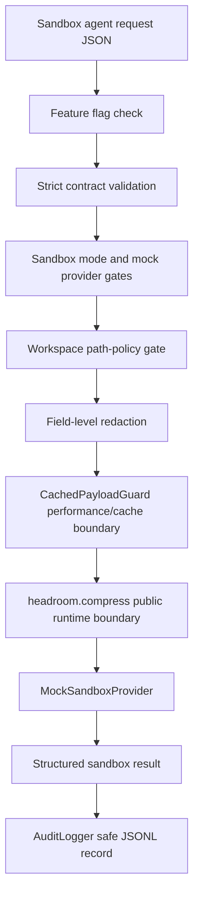

# Safe Sandbox Agent Integration Architecture

Task: `TOKENOM-SAFE-SANDBOX-AGENT-INTEGRATION-005`

This layer is a closed, dummy-only sandbox integration. It proves that Tokenom can receive a structured agent request, enforce local safety policy, cross the existing Tokenom runtime/performance boundary, call a mock provider, emit a structured result, and write a safe audit record. It is not a production agent workflow and it must not be used with private projects or real provider credentials.

## Discovery Summary

Gate 1:

```json
{
  "existing_runtime_entry_point_identified": true,
  "existing_security_components_identified": true,
  "existing_cache_integration_identified": true,
  "duplication_avoided": true
}
```

Existing components reused:

- Runtime entry point: `headroom.compress()` in `headroom/compress.py`.
- Security layer: `tokenom.security.redactor`, `scanner`, `path_policy`, `payload_policy`, and `audit_logger`.
- Redaction utilities: `redact_text()` and `scan_text()`, extended for email, Windows user paths, and password assignments.
- Path policy: `PathPolicy` and the denylist mirrored by `config/path_policy.yaml`.
- Performance/cache integration: `CachedPayloadGuard` and `SHA256PayloadCache`.
- Native-core boundary: `headroom._core` import check is surfaced in runtime metadata.
- Configuration: environment feature flags are already used elsewhere; this layer adds `TOKENOM_SANDBOX_AGENT_INTEGRATION_ENABLED`.
- CLI: existing Click group in `headroom.cli.main`.
- Test conventions: pytest tests under `tests/test_*.py` with fixtures in `tests/fixtures`.
- Audit convention: `AuditLogger` writes JSONL redacted payloads and never writes raw prompts/responses by default.
- Rollback pattern: one explicit feature flag, default disabled.

## Flow



## Trust Boundaries

- Request boundary: accepts only the strict sandbox request contract.
- Filesystem boundary: only `tests/fixtures/sandbox_agent/workspace` or injected test temp roots are accepted.
- Provider boundary: only `MockSandboxProvider` can be invoked.
- Runtime boundary: the flow crosses Tokenom's public compression runtime and existing cached guard path.
- Audit boundary: audit records contain safe metadata, policy decisions, counts, runtime flags, and prompt hash only.

## Request Contract

```json
{
  "request_id": "sandbox-request-001",
  "mode": "sandbox",
  "task_type": "dummy_agent_task",
  "input": {
    "prompt": "Summarize the dummy fixture",
    "context": {}
  },
  "workspace": {
    "root": "<repo>/tests/fixtures/sandbox_agent/workspace"
  },
  "provider": "mock",
  "metadata": {
    "source": "tokenom_sandbox_test"
  }
}
```

Allowed metadata keys are `source` and `mock_behavior`. Unknown top-level, input, workspace, and metadata keys are rejected.

## Result Contract

```json
{
  "request_id": "sandbox-request-001",
  "status": "completed",
  "mode": "sandbox",
  "provider": "mock",
  "output": {
    "content": "Mocked sandbox result"
  },
  "security": {
    "redaction_applied": false,
    "path_policy_passed": true,
    "external_network_used": false,
    "real_provider_used": false,
    "provider_called": true
  },
  "runtime": {
    "tokenom_runtime_invoked": true,
    "optimization_layer_invoked": true,
    "cache_checked": true,
    "native_core_available": true
  },
  "audit_id": "..."
}
```

Blocked requests return `status: "blocked"` and `security.provider_called: false`.

## Known Limitations

- No real provider is implemented or selectable.
- No production/private project mode is allowed.
- The sandbox workspace is intentionally limited to dummy fixtures.
- The runtime call is bounded for smoke tests; cache/optimization proof is surfaced through `CachedPayloadGuard` counters and `headroom.compress()` invocation metadata.
